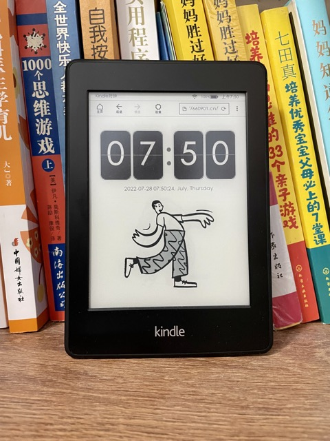

# kindle插画时钟~kindle变废为宝记（Kindle Illustration Clock）

## 开发初衷 Development Motivation

```中文
某天在小红书上发现有人用kindle 做时钟，而且还有名言名句，天天激励着我们，只可惜7月份关了。
怎么办？我也是码农出生，那就自己写一个吧，前提是必须好看，并且我有个特别爱画画的女儿，于是这个作品的灵感诞生了
作品中的插画一部分是开源的，另一部分是找我喜欢的插画师化缘的，最后有可能会上我姑娘亲手画的，希望各位喜欢
```
```English
One day, I found someone using a Kindle as a clock on Xiaohongshu, and it also had famous quotes to inspire us every day. Unfortunately, it was closed in July.
What to do? As a programmer by trade, I decided to write my own. The premise is that it must be beautiful, and I have a daughter who loves to draw, so the inspiration for this work was born.
Some of the illustrations in the work are open source, some are from my favorite illustrators, and some might be drawn by my daughter herself. I hope everyone will like it.
```

## 作品风格 Work Style



```中文
1.时钟仿Mac时钟风格，非常优雅而时尚
2.按分准点刷新，不会让你有时差感，特别适合处女座
3.每日会更新插画，让家居环境更加美观且有科技感
```
```English
The clock mimics the Mac clock style, which is very elegant and fashionable.
It refreshes on the minute, so you won't feel any time lag, making it especially suitable for Virgos.
The illustrations are updated daily, making the home environment more beautiful and technological.
```

## Kindle 配置教程 Configuration Tutorial

```中文
1. kindle 进入主页，点击右上角的3个点
2. 出现下拉菜单后，点击 体验版网页浏览器
3. 进入后，点击地址框，输入 地址 ，回车即可
4. 地址栏里再输入 ～ds ，让页面常亮。（这是官方命令，无法～ds的小伙伴可能是升级系统了，我挺失望的）
5. 最后建议插上电源线，底座可以买一个，也可以像我一样用积木搭一个。
```
```English
1. Enter the Kindle home page, click the 3 dots in the upper right corner.
2. After the drop-down menu appears, click the Experience Web Browser.
3. After entering, click the address box, enter the address, and press Enter.
4. In the address bar, enter ～ds, and let the page be always on. (This is an official command that cannot be ～ds. If you are a small friend, you may have upgraded the system, I am disappointed.)
5. Finally, it is recommended to plug in the power cord. The base can be bought, or you can use LEGO to build one.
```

## iPad /iPhone 配置教程 Configuration Tutorial

```中文
1. 打开Safari 浏览器，地址栏输入 地址 回车即可
2. 设置桌面书签。浏览器里点击 共享 按钮，选择 添加到主屏幕 ，然后命名，再选择 添加 ，就会在桌面上生成快捷图标。这样从桌面可以点快捷图标进入
3. 配置屏幕不自动锁定。打开手机设置功能，选择 显示与亮度 ，找到 自动锁定，选择 永不。这样屏幕就不会自动锁定，大家可以快乐的欣赏美美的时间和插画了。
如上功能位置可能随系统版本不同有所差异，但一定会有，请各位耐心查找。
```
``` English
1. Open the Safari browser, enter the address and press Enter.
2. Set the desktop bookmark. Click the Share button in the browser, select Add to Home Screen, name it, and select Add. Then it will be generated on the desktop. You can click the shortcut icon on the desktop to enter.
3. Configure the screen to not automatically lock. Open the phone settings function, select Display and Brightness, find Auto Lock, select Never. Then the screen will not automatically lock, and everyone can enjoy beautiful time and illustrations.
The position of the above function may vary according to the system version, but it will certainly be there, please find it patiently.
```

## 安装 Project setup 

```
npm install
```

### 编译并运行 Compiles and hot-reloads for development

```
npm run serve
```

### 生产环境编译 Compiles and minifies for production

```
npm run build
```
